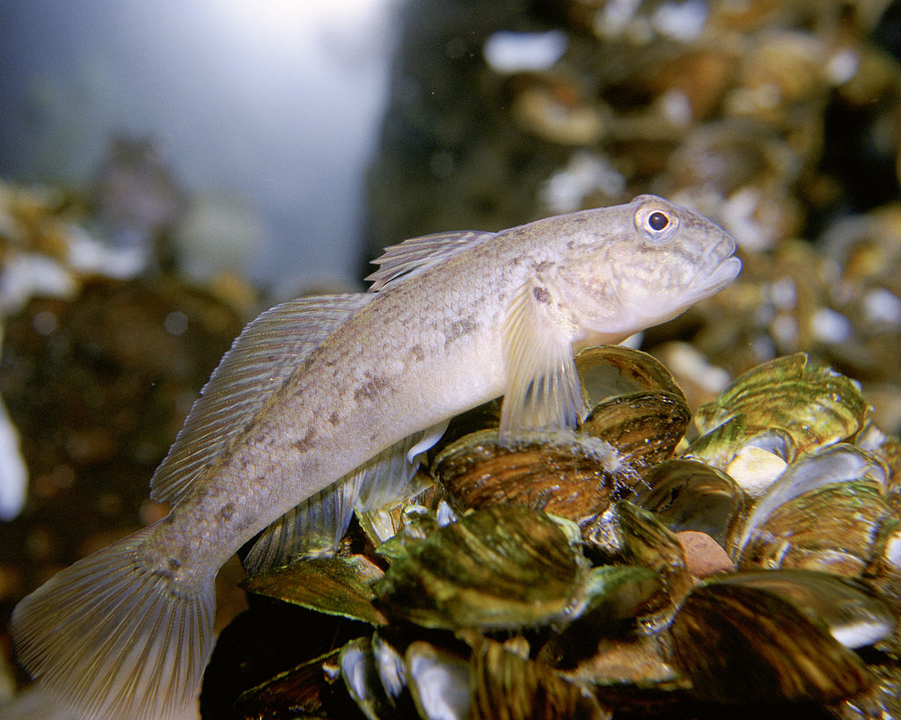

```{r setup, include=FALSE}
knitr::opts_chunk$set(echo = TRUE)
```

Bleeker et al. (2017) examined variability in reproductive characteristics of a goby (*Neogonius melanostomus*) along the Rhine River in Europe. They had five sampling sites along the Rhine and imagine that the five sites represented a random sample from a population of possible sites. At each site they had between seven and 22 fish; the response variable was gonad mass and the covariate was body length (centered as a body length of zero is nonsensical). Our interest is how the relationship between gonad mass and body length varied across the random effect of site.

[](https://upload.wikimedia.org/wikipedia/commons/6/6b/Neogobius_melanostomus1.jpg)
Eric Engbretson, U.S. Fish and Wildlife Service, Public domain, via Wikimedia Commons

The paper is [here](doi:10.1371/journal.pone.0174828)

Bleeker, K., de Jong, K., van Kessel, N., Hinde, C. A. & Nagelkerke, L. A. J. (2017). Evidence for ontogenetically and morphologically distinct alternative reproductive tactics in the invasive Round Goby Neogobius melanostomus. *PLoS One*, 12.

## Preliminaries

First, load the required packages (afex, car, lattice, lme4, lmerTest, nlme, VCA)

```{r include=FALSE, results='hide'}
source("../R/libraries.R")   #This is the common library
```

Import bleeker data file (bleeker1.csv)

```{r}
bleeker1 <- read.csv("../data/bleeker1.csv")
bleeker1
```

Set contrasts from afex

```{r}
set_sum_contrasts()
```

### Focus on models with covariate

Check linearity and then variances

```{r}
panel.smoother <- function(x, y) {
  panel.xyplot(x, y) 
  panel.lmline(x, y)
}
xyplot(gm~tl|river,main="Scatterplots by River", ylab="gonad weight", xlab="total length", panel=panel.smoother, bleeker1)
# check boxplots - variance difference for gm but not related to mean
boxplot(gm~river, bleeker1)
boxplot(tl~river, bleeker1)

```

Linearity seems OK and variance difference for gonad mass but not related to mean

### Fit random coefficients model

```{r}
bleeker.lmer1 <- lmer(gm~tl +(tl|river), REML=TRUE, bleeker1)
summary(bleeker.lmer1)
plot(bleeker.lmer1)
isSingular(bleeker.lmer1)
```

### Remove correlation between random effects

```{r}
bleeker.lmer2 <- lmer(gm~tl +(tl||river), REML=TRUE, bleeker1)
summary(bleeker.lmer2)
plot(bleeker.lmer2)
isSingular(bleeker.lmer2)
```

Removing correlation makes little difference to model's fit

### Singular warning so try with centered covariate

```{r}
bleeker1$ctl <- scale(bleeker1$tl, center=TRUE, scale=FALSE)
bleeker.lmer3 <- lmer(gm~ctl +(ctl||river), REML=TRUE, bleeker1)
summary(bleeker.lmer3)
isSingular(bleeker.lmer3)
```

**Correlation between random effects reduced but still warning about singularity**

### Proceeded to compare random coefficients and random intercepts model with nlme. Also generate AICc for each model

```{r}
bleeker.lme1 <- lme(fixed=gm~ctl, random=~1|river/ctl, method="REML", bleeker1)
bleeker.lme2 <- lme(fixed=gm~ctl, random=~1|river, method="REML", bleeker1)
anova(bleeker.lme1, bleeker.lme2)

#AICc
AICc(bleeker.lme1)
AICc(bleeker.lme2)
```

Difference in fit of the two models is not great, so we will ignore the random coefficients (river x length)

### Fit random intercept model with lmer

```{r}
bleeker.lmer4 <- lmer(gm~ctl +(1|river), REML=TRUE, bleeker1)
plot(bleeker.lmer4)
```

Residuals look fine

```{r}
summary(bleeker.lmer4, ddf="Kenward-Roger")
anova(bleeker.lmer4, ddf="Kenward-Roger")
```

### Get profile confidence intervals from lmer fit

```{r}
bleeker.ci <- confint.merMod(bleeker.lmer4)
bleeker.vc <- (bleeker.ci)^2
print(bleeker.vc)

```
