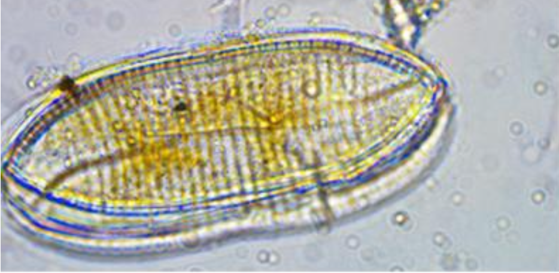

```{r setup, include=FALSE}
knitr::opts_chunk$set(echo = TRUE)
```

Medley and Clements (1998) sampled stations on six streams in a region of the Rocky Mountains of Colorado, USA known to be polluted by heavy metals. They recorded zinc concentration, and species richness and species diversity of the diatom community and proportion of diatom cells that were the early-successional species, *Achnanthes minutissima*. We'll focus on the species diversity.

{width="600"}

These data were used in the first edition and the file is [here](../data/medley.csv).

Medley, C. N. & Clements, W. H. (1998). Responses of diatom communities to heavy metals in streams: The influence of longitudinal variation. *Ecological Applications*, 8, 631-44.

### Preliminaries

First, make sure the core set of packages is loaded, then load any that are specific to this Box.

Load the required packages (car, sjstats, lmPerm)

```{r include=FALSE, results='hide'}
source("../R/libraries.R")   #This is the common library
library(lmPerm)
library(agricolae)
```

Import medley data file (medley.csv)

```{r}
medley <- read.csv("../data/medley.csv")
head(medley,10)
#make zinc is treated as a factor and arrange in sensible order
medley$zinc<-factor(medley$zinc)
medley$zinc<-fct_relevel(medley$zinc,c("BACK", "LOW", "MED", "HIGH"))
```

### Fit model for diversity

```{r }
medley.aov <- aov(diversity~zinc, data=medley)
```

Check diagnostics

```{r }
plot(medley.aov)
```

#### Examine model results

```{r }
glance(medley.aov)
tidy(medley.aov)
#summary(medley.aov)
```

Get effect sizes

```{r }
effectsize(medley.aov)
effectsize(medley.aov, type = "omega")
effectsize(medley.aov, type = "f")
emmeans(medley.aov, ~zinc)
```

Get default reference coding contrasts

```{r }
summary.lm(medley.aov)
```

Check to make sure reference is Background

```{r}
contrasts(medley$zinc) <- contr.treatment(4, base = 1)
medley2.aov<-aov(data=medley, diversity~zinc)
summary.lm(medley2.aov)

```

### Unplanned comparisons

Get Tukey pairwise comparisons and Dunnett test

```{r }
med_emm <-emmeans(medley.aov, ~zinc)
contrast(med_emm, "tukey")
contrast(med_emm, "dunnett")   #Note already have BACK as default reference group
```

Run REGW test for comparison

This test uses the *agricolae* package

```{r}
rw<-REGW.test(medley.aov, "zinc", alpha=0.05, console=FALSE, group=FALSE)
rw
```

### Non-parametric approach

Do Kruskal-Wallis test

```{r }
kruskal.test(diversity~zinc, data=medley)
```

Randomization test (using lmPerm)

```{r }
medley.aovp <- aovp(diversity~zinc, perm="Exact", data=medley)
summary(medley.aovp)
```

### Levene's test

```{r }
leveneTest(medley$diversity, medley$zinc)
```
