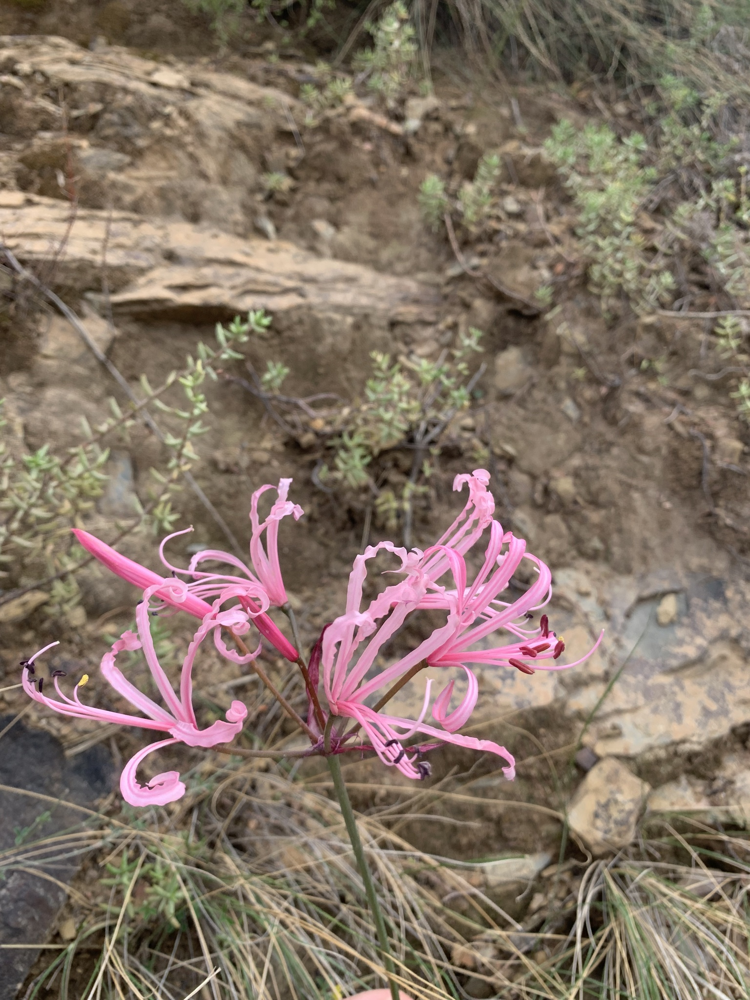

```{r setup, include=FALSE}
knitr::opts_chunk$set(echo = TRUE)
```

Newman et al. (2015) compared flower characteristics of two different phenotypes (short style and long style) of the geophytic plant *Nerine humilis* in South Africa. They had multiple populations for each phenotype (seven or eight short style and three long style, depending on response variable) and from each population, they measured flower characteristics (e.g. tepal length, nectar volume) from between 12 and 37 flowers per population. Phenotype (two groups) was an observational fixed factor, with population a random factor nested within phenotype; we will analyze tepal length as the response variable.

We show several ways to approach this data set, ranging from the "traditional" OLS nested analysis to simplified analysis using means, to linear mixed models and REML/ML. At this stage, it's useful to show you the ways you might encounter these analyses, but in practice you'd use one.

{width="600"}

*Nerine humilis*. Sam McCarren [{width="57"}](https://creativecommons.org/licenses/by/4.0), via iNaturalist. There's also a good picture of the different phenotypes as Figure 1 of Newman et al.

The paper is [here](https://doi.org/10.1111/evo.12736), and the data are at [dryad](https://datadryad.org/stash/dataset/doi:10.5061/dryad.c8fb1), as an Excel file *floral_traits nested ANOVA* and we've used the *tepal length* sheet for this example*.*

Newman, E., Manning, J. & Anderson, B. (2015). Local adaptation: Mechanical fit between floral ecotypes of *Nerine humilis* (Amaryllidaceae) and pollinator communities. *Evolution*, 69, 2262-75.

### Preliminaries

First, load the required packages (afex, car, lattice, lme4, lmerTest, nlme, VCA, Rmisc)

```{r include=FALSE, results='hide'}
source("../R/libraries.R")   #This is the common library
```

Import newman data file (newman_tepal.csv)

```{r}
newman_tepal <- read.csv("../data/newman_tepal.csv")
head(newman_tepal,10)
```

Make population a factor

```{r }
newman_tepal$population <- factor(newman_tepal$population)
```

Calculate summary stats by groups

```{r }
newman_sum <- summarySE(newman_tepal,measurevar='tepal', groupvars= c('population','phenotype'))
newman_sum
```

do preliminary checks (look OK)

```{r }
boxplot(tepal~phenotype, data=newman_tepal)
boxplot(tepal~phenotype, data=newman_sum)
```

## Fit nested anova model

Note: Defaults to Type I SS in *R* - can't change it with nested aov structures. Need to get Type III from another package (e.g. spss) - very similar to Type I and II anyway

```{r }
newman.aov <- aov(tepal~phenotype+Error(population), newman_tepal)
```

Plot residuals based on colonies

```{r }
plot(resid(newman.aov[[2]])~fitted(newman.aov[[2]]))
```

### Get anova summary

```{r }
options(digits=3)
summary(newman.aov)
```

### Use lm command as an alternative

```{r }
newman.lm1 <- lm(tepal~phenotype+phenotype/population, newman_tepal)
summary(newman.lm1)
anova(newman.lm1)
Anova(newman.lm1, type="II")
1-pf(11.060, 8, 236, lower.tail = TRUE, log.p = FALSE)
```

This output is treating populations as a fixed effect, so to show comparability with the initial nested effect, we need to recalculate the test for phenotype, using populations as the denominator.

```{r}
f <- 127.8/11.1
f
1-pf(f, 1, 8, lower.tail = TRUE, log.p = FALSE)
```

## Demonstrate nested is similar to one-way on colony means

```{r }
newman.aov2 <- aov(tepal~phenotype, newman_sum)
summary(newman.aov2)
```

Analysis using means won't be exactly the same because sample sizes vary among populations.

### Variance components using VCA package

```{r }
newman.vca <- anovaMM(tepal~phenotype/(population), newman_tepal)
newman.vca
VCAinference(newman.vca, alpha=0.05, VarVC=TRUE, ci.method="satterthwaite")
```

## Mixed model using lme4

```{r }
newman.reml <- lmer(tepal~phenotype + (1|population), newman_tepal)
summary(newman.reml)
newman.ml <- lmer(tepal~phenotype + (1|population), newman_tepal, REML=F)
summary(newman.ml)
```

CI on variance components (remembering to square CIs from lmer with are in SD units)

```{r }
newman.ci <- confint.merMod(newman.reml)
newman.vc <- (newman.ci)^2
print(newman.vc)
```

Test fixed effect using likelihood ratio tests

```{r }
newman.lme <- lmer(tepal~phenotype + (1|population), newman_tepal, REML=F)
newman.lme1 <- lmer(tepal~(1|population), newman_tepal, REML=F)
anova(newman.lme,newman.lme1)
```

### Using lmerTest

```{r }
summary(newman.reml)
```

Get more reliable F-test than original anova for fixed effect based on Satterthwaite's (default) and Kenward-Roger's adjustment to df

```{r }
anova(newman.reml)
anova(newman.reml, ddf="Kenward-Roger")
```
