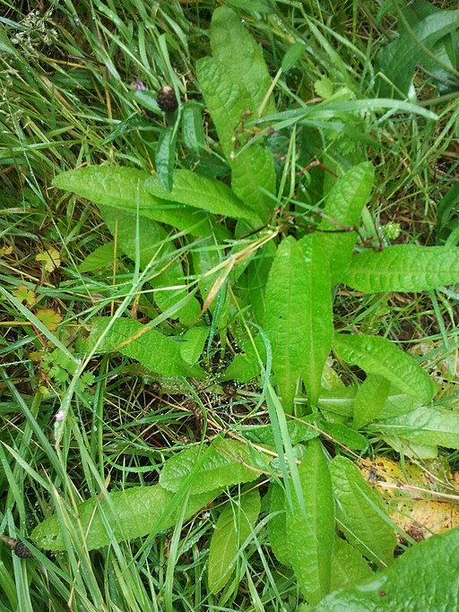

```{r setup, include=FALSE}
knitr::opts_chunk$set(echo = TRUE)
```

Shaw and Shackleton (2010) studied the effects of four factors (insect supplementation, water treatment, site and rosette size) on growth and seed set of a biennial herb, the teasel (*Dipacus fullonum*) near London. The design was fully balanced with three plants per factor combination. Preliminary analyses of both response variables (using residual plots) suggested a need transformation. In both cases, small predicted values were associated with small spreads of residuals. For seed set, variance of the residuals increased steadily with predicted values (Figure 7.8), whereas residuals for biomass showed a pattern of strongly increasing, then decreasing spread of the residuals. In both cases, log-transformation of the response variable removed the issues with the distribution of residuals.

[](https://commons.wikimedia.org/wiki/File:Teasel_leaf_low.jpg)

Blokenearexeter, CC0, via Wikimedia Commons


Shaw, P. J. A. & Shackleton, K. (2010). Carnivory in the teasel *Dipsacus fullonum*---the effect of experimental feeding on growth and seed set. *PLoS One*, 6, e17935.

The paper is [here](https:doi.org/10.1371/journal.pone.0017935).

## Preliminaries

First, load the required packages (car, sjstats) + ggplot2, patchwork, emmeans

```{r include=FALSE, results='hide'}
source("../R/libraries.R")   #This is the common library
library(sjstats)
```

Import shawshack data file (shawshack.csv)

```{r}
shawshack <- read.csv("../data/shawshack.csv")
head(shawshack,10)
```

Convert predictors to factors

```{r }
shawshack$site <- factor(shawshack$site)
shawshack$sizeclass <- factor(shawshack$sizeclass)
shawshack$maggot <- factor(shawshack$maggot)
shawshack$water <- factor(shawshack$water)
```

### Fit model to untransformed seedmass and check residuals

```{r }
shawshack1.aov <- aov(seedmass~site*sizeclass*maggot*water, data=shawshack)
plot(shawshack1.aov)
```

### Fit model to untransformed biomass and check residuals

```{r }
shawshack2.aov <- aov(biomass~site*sizeclass*maggot*water, data=shawshack)
plot(shawshack2.aov)
```
Residuals show patterns

## Analyse log transformed data for both

### Fit models and check residuals first

```{r }
shawshack3.aov <- aov(log10(seedmass)~site*sizeclass*maggot*water, data=shawshack)
plot(shawshack3.aov)
```

```{r }
shawshack4.aov <- aov(log10(biomass)~site*sizeclass*maggot*water, data=shawshack)
plot(shawshack4.aov)
```

### Get model results
Tests, then effect sizes

**Seed mass**

```{r }
summary(shawshack3.aov)
anova_stats(shawshack3.aov)
```

**Now biomass**

```{r }
summary(shawshack4.aov)
anova_stats(shawshack4.aov)
```

## Figures
```{r include=FALSE, results='hide'}
source("../R/appearance.R")   #This is the common library of graphics tweaks, defining the qk theme
```
The first figure, 7.7 in the book, is a panel of 4 residual plots, 2 dependent variables, raw and transformed

```{r}
p1<-ggplot(shawshack1.aov, aes(x = shawshack1.aov$fitted.values, y = shawshack1.aov$residuals)) +
  geom_point(color=sc, alpha=0.5) +
  theme_classic(base_size = 10)+
  theme(
    axis.text = element_blank(),
    axis.line = element_line(color = ac),
    axis.ticks = element_blank(),
    plot.title = element_text(hjust=0.5, size=8)
        )+labs(x = NULL, y = NULL, title="Seeds, Raw"
       )
p2<-ggplot(shawshack2.aov, aes(x = shawshack2.aov$fitted.values, y = shawshack2.aov$residuals)) +
  geom_point(color=sc, alpha=0.5) +
  theme_classic(base_size = 10)+
  theme(
    axis.text = element_blank(),
    axis.line = element_line(color = ac),
    axis.ticks = element_blank(),
    plot.title = element_text(hjust=0.5, size=8)
        )+labs(x = NULL, y = NULL, title="Growth, Raw"
       )
p3<-ggplot(shawshack1.aov, aes(x = shawshack3.aov$fitted.values, y = shawshack3.aov$residuals)) +
  geom_point(color=sc, alpha=0.5) +
  theme_classic(base_size = 10)+
  theme(
    axis.text = element_blank(),
    axis.line = element_line(color = ac),
    axis.ticks = element_blank(),
    plot.title = element_text(hjust=0.5, size=8)
        )+labs(x = NULL, y = NULL, title="Seeds, Log-transformed"
       )
p4<-ggplot(shawshack1.aov, aes(x = shawshack4.aov$fitted.values, y = shawshack4.aov$residuals)) +
  geom_point(color=sc, alpha=.5) +
  theme_classic(base_size = 10)+
  theme(
    axis.text = element_blank(),
    axis.line = element_line(color = ac),
    axis.ticks = element_blank(),
    plot.title = element_text(hjust=0.5, size=8)
        )+labs(x = NULL, y = NULL, title="Growth, Log-transformed"
       )
p1+p2+p3+p4
```
The second figure, 7.8 in the book, shows the effects that were detected. 
For seed number, there was a three-way interaction between plant size, insects, and water. We'll show that as two panels, each showing the relationship between water and insects, with one for large and one for small plants. There was a separate effect of site, which we show as a simple bar graph.
For growth, we detected an interaction between size and water, plus an independent main effect of site. We'll show the size x water interaction, pooling across the other factors.

```{r echo=FALSE, results='hide'}
#Use emmeans to get summary stats
emm1<-emmeans(shawshack3.aov, ~sizeclass|maggot|water)   #Extracts means for the 3-way interaction
emm2<-as.data.frame(emm1)
emm4<-emmeans(shawshack3.aov, ~site)   #Gets site means
emm5<-as.data.frame(emm4)
#Separate plots for large and small plants
#Means only
#Use filter to subset data for ggplot
emm3<-filter(emm2, sizeclass=="1")
pd=position_dodge(width=0)
p2<-ggplot(emm3,aes(x=maggot,y=emmean,shape=water, group=water, color=water))+
  geom_point(position=pd,aes(shape=water), size=3,show.legend = FALSE)+
  geom_line(aes(color=water), position=pd, size=ls, show.legend = FALSE)+
  scale_color_uchicago(labels = c("Water 0", "Water 1"))+
  labs(x = "Maggots", y = "Log(Seed mass)", title="Small Plants")+
  scale_y_continuous(expand = c(0,0), limits = c(0,1.2))+
  theme_qk()+
  theme(
    axis.text.x = element_text(color="black"),
    plot.title = element_text(hjust=0.5)
  )
emm3<-filter(emm2, sizeclass=="2")
pd=position_dodge(width=0)
p3<-ggplot(emm3,aes(x=maggot,y=emmean,shape=water, group=water, color=water))+
  geom_point(position=pd,aes(shape=water), size=3,show.legend = FALSE)+
  geom_line(aes(color=water), position=pd, size=ls, show.legend = FALSE)+
  scale_color_uchicago(labels = c("Water 0", "Water 1"))+
  labs(x = "Maggots", y = NULL, title="Large Plants"
       )+
  scale_y_continuous(expand = c(0,0), limits = c(0,1.2))+
  theme_qk()+
  theme(
    axis.text.y=element_blank(),
    axis.text.x = element_text(color="black"),
    plot.title = element_text(hjust=0.5),
    legend.title=element_blank()
)
p23<-p2+p3
p5<-ggplot(emm5, aes(x = site, y = emmean)) +
  geom_bar(stat = "identity", width=.6, color=lc, fill=lf)+
  scale_y_continuous(expand = c(0,0), limits = c(0,1.2))+
  labs(x = "Site", y = NULL)+
    theme_qk()+
    theme(
    axis.text.x = element_text(colour = "black", size=10),
      axis.text.y=element_blank(),
  )
#Use emmeans to get summary stats
emm1<-emmeans(shawshack4.aov, ~sizeclass|water)
emm2<-as.data.frame(emm1)
emm4<-emmeans(shawshack4.aov, ~site)
emm5<-as.data.frame(emm4)
#Separate plots for large and small plants
#Means only
#Use filter to subset data for ggplot
pd=position_dodge(width=0)
p6<-ggplot(emm2,aes(x=sizeclass,y=emmean,shape=water, group=water, color=water))+
  geom_point(position=pd,aes(shape=water), size=3,show.legend = FALSE)+
  geom_line(aes(color=water), position=pd, size=ls, show.legend = FALSE)+
  scale_color_uchicago(labels = c("Water 0", "Water 1"))+
  labs(x = "Plant Size", y = "Log(Biomass)")+
  scale_y_continuous(expand = c(0,0), limits = c(0,2.2))+
  theme_qk()+
  theme(
    axis.text.x = element_text(color="black"),
    plot.title = element_text(hjust=0.5)
  )
p7<-ggplot(emm5, aes(x = site, y = emmean)) +
  geom_bar(stat = "identity", width=.6, color=lc,fill=lf)+
  scale_y_continuous(expand = c(0,0), limits = c(0,2.2))+
  labs(x = "Site", y = NULL)+
    theme_qk()+
    theme(
    axis.text.x = element_text(colour = "black", size=10),
      axis.text.y=element_blank(),
  )
shawshack_gr<-(p23-p5)/(p6+p7)
shawshack_gr
```

