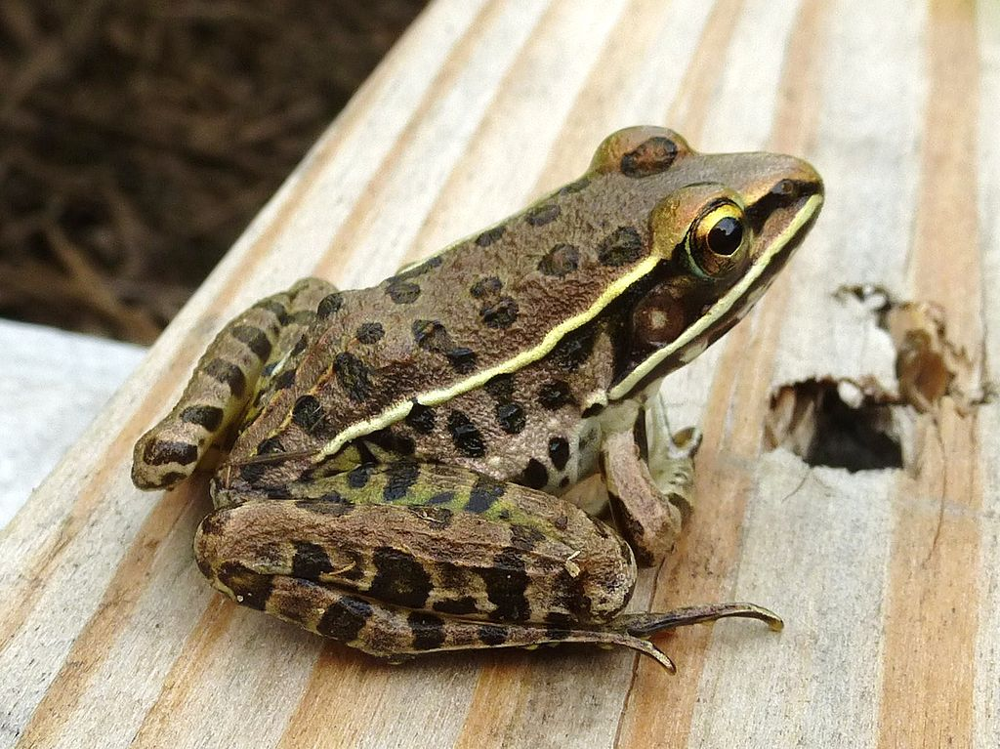
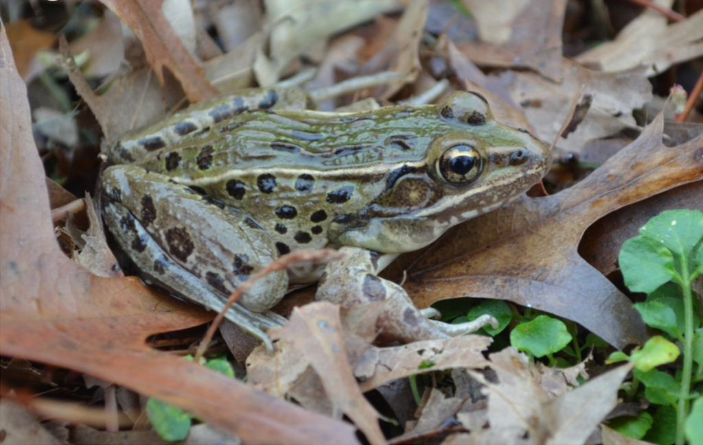

```{r setup, include=FALSE}
knitr::opts_chunk$set(echo = TRUE)
```

Feinberg et al. (2014) examined morphological, genetic, and acoustic (call) criteria in four species of leopard frogs (*Rana sphenocephala*, *R. pipiens*, *R. palustris*, and a new species named *R. kauffeldi*) and an acoustically similar congener *R. sylvatica* (acoustic criteria only). For 283 museum specimens across the first four species, they measured size (snout-vent length) and 12 other morphological characteristics: head length, head width, eye diameter, tympanum diameter, foot length, eye to naris distance, naris to snout distance, thigh length, internarial distance, interorbital distance, shank length, and dorsal snout angle. Foot length was not recorded for 19 specimens, so these were excluded from the analysis. They also recorded seven call characteristics (call length, call rate, call rise time, call duty cycle, pulse number, pulse rate, and dominant frequency) from 45 frogs in the field across the five species. Call rate and call length were both adjusted based on regressions against temperature to a standard 14°C. We will not cover the genetic analysis here, and we will use LDA to examine the different species in multivariate space and see if the proposed new species was distinguishable morphologically or acoustically.

[{width="300"}](https://upload.wikimedia.org/wikipedia/commons/0/06/Southern_Leopard_Frog%2C_Missouri_Ozarks.JPG)

*Rana sphenocephala*. Bob Warrick, [{width="57"}](https://creativecommons.org/licenses/by/4.0), via Wikimedia Commons

[_-_Waterloo,_Ontario_02.jpeg){width="300"}](https://upload.wikimedia.org/wikipedia/commons/7/70/Northern_Leopard_Frog_%28Lithobates_pipiens%29_-_Waterloo%2C_Ontario_02.jpg)

*Rana pipiens*. Ryan Hodnett, [{width="57"}](https://creativecommons.org/licenses/by/4.0), via Wikimedia Commons

[{width="300"}](https://upload.wikimedia.org/wikipedia/commons/7/73/Atlantic-coast-leopard-frog.png)

*Rana kauffeldi*. Brian R. Curry, [{width="57"}](https://creativecommons.org/licenses/by/4.0), via Wikimedia Commons

The paper is [here](https://doi.org/10.1371/journal.pone.0108213) and the data sets for this example are morphological [feinmorph.csv](../data/feinmorph.csv) and we also use the acoustic variables [feinacoust.csv](../data/feinacoust.csv)

Feinberg, J. A., Newman, C. E., Watkins-Colwell, G. J., Schlesinger, M. D., Zarate, B., Curry, B. R., Shaffer, H. B. & Burger, J. (2014). Cryptic diversity in metropolis: confirmation of a new leopard frog species (Anura: Ranidae) from New York City and surrounding Atlantic coast regions. *PLoS One*, 9, e108213.

### Preliminaries

Load required packages

```{r results='hide'}
# packages: vegan, car
source("../R/libraries.R")
library(vegan)
library(DAAG)
```

Read in data files

```{r }
feinmorph <- read_csv("../data/feinmorph.csv")
feinacoust<-read_csv("../data/feinacoust.csv")
```

Check linearity and distributions

```{r}
scatterplotMatrix(~hw+hl+td+ew+tl+sl+fl+end+nsd+iod+ind+dsa,data=feinmorph,diagonal=list(method='boxplot'))
```

Standardize variables

```{r}
feinmorph$hw <- scale(feinmorph$hw)
feinmorph$hl <- scale(feinmorph$hl)
feinmorph$td <- scale(feinmorph$td)
feinmorph$ew <- scale(feinmorph$ew)
feinmorph$tl <- scale(feinmorph$tl)
feinmorph$sl <- scale(feinmorph$sl)
feinmorph$fl <- scale(feinmorph$fl)
feinmorph$end <- scale(feinmorph$end)
feinmorph$nsd <- scale(feinmorph$nsd)
feinmorph$iod <- scale(feinmorph$iod)
feinmorph$ind <- scale(feinmorph$ind)
feinmorph$dsa <- scale(feinmorph$dsa)
```

Check homog variances and covariances

```{r}
feinmorph.dist <- dist(feinmorph[,-(1:2)])
feinmorph.disp <- betadisper(feinmorph.dist,feinmorph$spp)
permutest(feinmorph.disp)
anova(feinmorph.disp)
```

## LDA with jackknife CV

```{r}
feinmorphjac.lda <- lda(spp~hw+hl+td+ew+tl+sl+fl+end+nsd+iod+ind+dsa, data=feinmorph, CV=TRUE)
print(feinmorphjac.lda)
table(feinmorph$spp,feinmorphjac.lda$class)
```

Use Borcard code to get props correct

```{r}
feinmorphjac.class <- feinmorphjac.lda$class
feinmorphjac.table <- table(feinmorph$spp, feinmorphjac.class)
diag(prop.table(feinmorphjac.table,1))
```

Use DAAG confusion to get overall accuracy

```{r}
confusion(feinmorphjac.lda$class,feinmorph$spp)
```

## LDA

```{r}
feinmorph.lda <- lda(spp~hw+hl+td+ew+tl+sl+fl+end+nsd+iod+ind+dsa, data=feinmorph)
print(feinmorph.lda)
# get predictions from this LDA
feinmorph.pred <- predict(feinmorph.lda)
table(feinmorph$spp,feinmorph.pred$class)
# plot LDA
plot(feinmorph.lda, dimen=2)
```

## Now analyse acoustic data as for morphology

### Diagnostics

```{r}
# check linearity and distributions
scatterplotMatrix(~crt+cdc+pn+df+tcl+tcr,data=feinacoust,diagonal=list(method='boxplot'))
# standardize variables
feinacoust$crt <- scale(feinacoust$crt)
feinacoust$cdc <- scale(feinacoust$cdc)
feinacoust$pn <- scale(feinacoust$pn)
feinacoust$df <- scale(feinacoust$df)
feinacoust$tcl <- scale(feinacoust$tcl)
feinacoust$tcr <- scale(feinacoust$tcr)
# check var-cov homogeneity
feinacoust.dist <- dist(feinacoust[,-(1:2)])
feinacoust.disp <- betadisper(feinacoust.dist,feinacoust$spp)
permutest(feinacoust.disp)
```

### LDA with jackknife CV

```{r}
feinacoustjac.lda <- lda(spp~crt+cdc+pn+df+tcl+tcr, CV=TRUE, data=feinacoust)
print(feinacoustjac.lda)
table(feinacoust$spp,feinacoustjac.lda$class)
# use Borcard code to get props correct
feinacoustjac.class <- feinacoustjac.lda$class
feinacoustjac.table <- table(feinacoust$spp, feinacoustjac.class)
diag(prop.table(feinacoustjac.table,1))
# use DAAG confusion to get overall accuracy
confusion(feinacoustjac.lda$class,feinacoust$spp)
```

## LDA

```{r}
feinacoust.lda <- lda(spp~crt+cdc+pn+df+tcl+tcr, data=feinacoust)
print(feinacoust.lda)
# get eigenvalues (prop explained)
feinacoust.lda$svd
propexp <- feinacoust.lda$svd^2/sum(feinacoust.lda$svd^2)
propexp
feinacoust.pred <- predict(feinacoust.lda)
table(feinacoust$spp,feinacoust.pred$class)
plot(feinacoust.lda, dimen=2)
```

### Finally, do MANOVAs

```{r}
morph <- cbind(feinmorph$hw,feinmorph$hl,feinmorph$td,feinmorph$ew,feinmorph$tl,feinmorph$sl,feinmorph$fl,feinmorph$end,feinmorph$nsd,feinmorph$iod,feinmorph$ind,feinmorph$dsa)
feinmorph.man <- manova(morph~spp, data=feinmorph)
summary(feinmorph.man, test="Pillai")
acoust <- cbind(feinacoust$crt,feinacoust$cdc,feinacoust$pn,feinacoust$df,feinacoust$tcl,feinacoust$tcr)
feinacoust.man <- manova(acoust~spp, data=feinacoust)
summary(feinacoust.man, test="Pillai")
```

### Better graphics

Plots used for QK use the ggplot classic theme, with some tweaks. Tweaks are consolidated into theme_QK; use this theme for figures and tweak the theme to avoid repetitive code changes.

```{r}
source("../R/appearance.R")
```

```{r}
lda.data <- cbind(feinmorph, predict(feinmorph.lda)$x)
#Get complex hulls
hull <- 
  lda.data %>%
  group_by(spp) %>% 
  slice(chull(LD1, LD2))
la=c("R.kauffeldi", "R. pipiens", "R. palustris", "R. spheno.", "R. sylvatica")
p1<-ggplot(lda.data, aes(LD1, LD2)) +
  geom_point(aes(shape = spp), show.legend=FALSE, size= ss/2)+
  scale_shape_manual(values=c(0:5))+
  geom_polygon(data=hull, aes(fill = spp,
                   ), color=lc,
               alpha = 0.3,
               show.legend = FALSE)+
  scale_fill_grey(start = 0.4, end = .9)
  
lda2.data <- cbind(feinacoust, predict(feinacoust.lda)$x)
#Get complex hulls
hull2 <- 
  lda2.data %>%
  drop_na() %>%
  group_by(spp) %>% 
  slice(chull(LD1, LD2))
p2<-ggplot(lda2.data, aes(LD1, LD2)) +
  geom_point(aes(shape = spp), size=ss/2)+
  scale_shape_manual(values=c(0:5),
                     name="Species",
                     labels=la,
                     guide =
                         guide_legend(label.theme = element_text(angle = 0, face = "italic", size=6),
                                    title=NULL))+
  labs(y=NULL)+
  geom_polygon(data=hull2, aes(fill = spp,
                   ), colour = "black",
               alpha = 0.3,
               show.legend = FALSE)+
  scale_fill_grey(start = 0.4, end = .9)
   
```

```{r}
p3<-p1+p2 & theme_qk()
p3
```

Colour fig

```{r}
p1a<-ggplot(lda.data, aes(LD1, LD2, colour=spp)) +
  geom_point(aes(), show.legend=FALSE, size= ss/2)+
  scale_color_viridis_d()+
  geom_polygon(data=hull, aes(fill = spp,
                   ), 
               alpha = 0.3,
               show.legend = FALSE)+
  scale_fill_viridis_d()
  
p2a<-ggplot(lda2.data, aes(LD1, LD2, colour=spp)) +
  geom_point(size=ss/2)+
  scale_color_viridis_d(
                     name="Species",
                     labels=la,
                     guide =
                         guide_legend(label.theme = element_text(angle = 0, face = "italic", size=6),
                                    title=NULL))+
  labs(y=NULL)+
  geom_polygon(data=hull2, aes(fill = spp,
                   ),
               alpha = 0.3,
               show.legend = FALSE)+
  scale_fill_viridis_d()
p3a<-p1a+p2a&theme_qk()   
p3a
```
