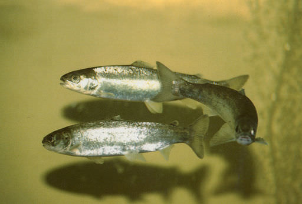

```{r setup, include=FALSE}
knitr::opts_chunk$set(echo = TRUE)
```

Giri et al. (2016) were interested in the capacity of Atlantic salmon (*Salmo salar*), grown in an aquaculture situation, to deliver high levels of omega-3 long-chain polyunsaturated fatty acids (PUFA) in their tissues. Specifically, they tested whether several micronutrients (iron, zinc, magnesium) and coenzymes (riboflavin, biotin and niacin) could increase the conversion from short- to long-chain PUFA. They used four treatments, a diet lacking in these micronutrients and coenzymes (T-0), a diet with normal levels (T-100), and two levels of fortification, where the enzymes and micronutrients were 300% and 600% greater than normal (T-300 and T-600).

[](https://upload.wikimedia.org/wikipedia/commons/thumb/d/d3/Salmo_salar_smolts.jpg/256px-Salmo_salar_smolts.jpg)

E. Peter Steenstra/USFWS, Public domain, via Wikimedia Commons

Giri, S. S., Graham, J., Hamid, N. K. A., Donald, J. A. & Turchini, G. M. (2016). Dietary micronutrients and in vivo n−3 LC-PUFA biosynthesis in Atlantic salmon. *Aquaculture*, 452, 416-25.

Link to [paper](doi:10.1016/j.aquaculture.2015.05.022); the data are available [here](../data/giri.csv)

### Preliminaries

First, load the required packages (sjstats, pwr)

```{r include=FALSE, results='hide'}
source("../R/libraries.R")   #the libraries script loads a common set of packages
library(pwr)
```

Import giri data file (giri.csv)

```{r}
giri <- read.csv("../data/giri.csv")
head(giri,10)
```

Make treat a factor

```{r }
giri$treat <- factor(giri$treat)
```

### Fit model for long-chain omega-3 fatty acids as the response variable

This is the variable n.3.lc.PUFA

```{r }
giri.aov <- aov(n.3.LC.PUFA~treat, data=giri)
```

Check diagnostics. We are most interested in the residual plot.

```{r }
plot(giri.aov)
```

Nothing of concern in diagnostic plots

### Examine model results.

```{r }
tidy(giri.aov)
```

Get effect sizes

```{r }
#effectsizes used here to get eta-squared values, which tidy doesn't provide
effectsize(giri.aov)
effectsize(giri.aov, type = "omega")
effectsize(giri.aov, type = "f")
emmeans(giri.aov, ~treat)
```

### Do linear polynomial contrast

```{r }
contrasts(giri$treat) <- contr.poly(4, scores=c(0, 100, 300, 600))
giri1.aov <- aov(n.3.LC.PUFA~treat, data=giri)
summary.aov(giri1.aov, split=list(treat=list("Linear"=1, "Quadratic"=2)))
```
