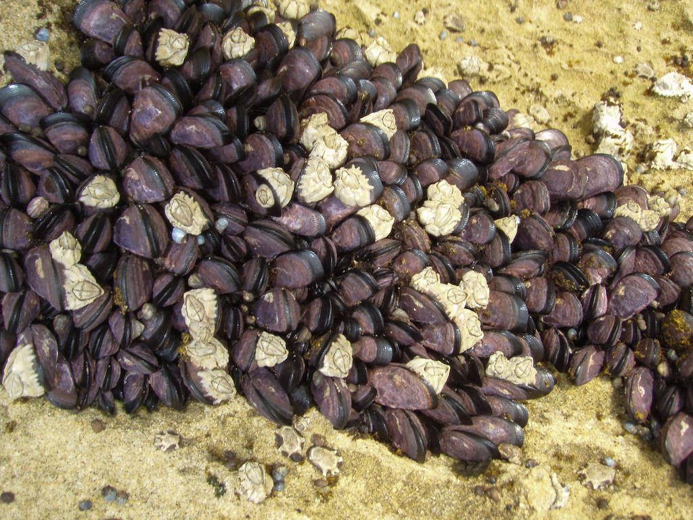

```{r setup, include=FALSE}
knitr::opts_chunk$set(echo = TRUE)
```

Peake and Quinn (1993) investigated the relationship between the number of species of macroinvertebrates, the total abundance of macroinvertebrates, and area of clumps of mussels on a rocky shore in southern Australia. The variables of interest are clump area (dm^2^), number of species, and number of individuals.

{width="800"}

Clump of mussels, with barnacles and gastropods in the clump. Mick Keough [{width="57"}](#0)

The data set was used in the first edition; get it [here](data/peakquinn.csv) Peake, A. J. & Quinn, G. P. (1993). Temporal variation in species-area curves for invertebrates in clumps of an intertidal mussel. *Ecography*, 16, 269-77.

### Preliminaries

First, load the required packages (pwr)

```{r results='hide'}
source("../R/libraries.R")   #the libraries script loads a common set of packages
library(pwr)
```

Load the data file and transform area, species and indiv

```{r}
peakquinn <- read_csv("../data/peakquinn.csv")
head(peakquinn)
peakquinn$larea<-log10(peakquinn$area)
peakquinn$lspecies<-log10(peakquinn$species)
peakquinn$lindiv<-log10(peakquinn$indiv)
```

### The relationship between species and area

```{r}
scatterplot (species~area, data=peakquinn)
```

Problems with distributions, so use logged values

```{r}
scatterplot (lspecies~larea, data=peakquinn)
pq.lm<-lm(lspecies~larea, data=peakquinn)
plot(pq.lm)
```
Residuals, etc., look much better now

Look at model fit
```{r}
options(digits=3)   # Tidy up output
augment(pq.lm)
glance(pq.lm)
tidy(pq.lm, conf.int = TRUE)
```

And if you want the traditional ANOVA table...

```{r}
anova(pq.lm)
```

Note that all the information is in more compact form in the earlier output


### Now look at number of individuals vs clump area

```{r}
scatterplot (indiv~area, data=peakquinn)
pq2.lm<-lm(indiv~area,data=peakquinn)
plot(pq2.lm)
```

Scatterplot suggests non-linear relationship and the residual plot shows a pattern. Use log-transformed data

```{r}
pq3.lm<-lm(lindiv~larea, data=peakquinn)
plot(pq3.lm)
augment(pq3.lm)
glance(pq3.lm)
tidy(pq3.lm, conf.int = TRUE)
#And if you want the traditional ANOVA table...
anova(pq3.lm)

```

## Nicer graphic

### Fig 6.13

First load script that produces standard graphics appearance (code hidden)

```{r include=FALSE, results='hide'}
source("../R/appearance.R") #This is the common library 
```

```{r}
p<-ggplot(peakquinn, aes(x=larea, y=lspecies))+
  geom_point(color=sc)+
  geom_smooth(method="lm", se=FALSE, color=lc)+
  theme_classic(base_size = 10)+
  theme(
    axis.text = element_text(colour = ac),
    axis.line = element_line(color = ac),
    axis.ticks = element_line(color = ac),
        )+
  xlab("Log area")+ylab("Log no. species")
#Add marginal box plots
p1<-ggMarginal(p,size=20, type="boxplot")
p1
```

Residual plot

```{r}
p2<-ggplot(pq.lm, aes(x = pq.lm$fitted.values, y = pq.lm$residuals)) +
  geom_point(color=sc) +
  geom_smooth(se=FALSE, colour=lc)+
  theme_classic(base_size = 10)+
  theme(
    axis.text = element_text(colour = ac),
    axis.line = element_line(color = ac),
    axis.ticks = element_line(color = ac),
        )+labs(x = "Predicted log no. species", y = "Residuals", 
       )
p2
```

#### Fig 6.14 - indiv vs area

```{r}
p3<-ggplot(peakquinn, aes(x=area, y=indiv))+
  geom_point(color = sc)+
  geom_smooth(se = FALSE, color = lc)+
  theme_classic(base_size = 10)+
  theme(
    axis.text = element_text(colour = ac),
    axis.line = element_line(color = ac),
    axis.ticks = element_line(color = ac),
        )+
  xlab("Area")+ylab("No. individuals")
#Add marginal box plots
p4<-ggMarginal(p3,size=20, type="boxplot")
p4
```

Residual plot

```{r}
p5<-ggplot(pq2.lm, aes(x = pq2.lm$fitted.values, y = pq2.lm$residuals)) +
  geom_point(color=sc) +
  theme_classic(base_size = 10)+
  theme(
    axis.text = element_text(colour = ac),
    axis.line = element_line(color = ac),
    axis.ticks = element_line(color = ac),
        )+labs(x = "Predicted log no. species", y = "Residuals", 
       )
p5
```

#### Fig 6.15

```{r}
p6<-ggplot(peakquinn, aes(x=larea, y=lindiv))+
  geom_point(color=sc)+
  geom_smooth(method="lm", color="black")+
  theme_classic(base_size = 10)+
  theme(
    axis.text = element_text(colour = ac),
    axis.line = element_line(color = ac),
    axis.ticks = element_line(color = ac),
        )+
  xlab("Log area")+ylab("Log no. indiv.")
#Add marginal box plots
p7<-ggMarginal(p6,size=20, type="boxplot")
p7
```

Residual plot

```{r}
p8<-ggplot(pq3.lm, aes(x = pq3.lm$fitted.values, y = pq3.lm$residuals)) +
  geom_point(color=sc) +
  theme_classic(base_size = 10)+
  theme(
    axis.text = element_text(colour = ac),
    axis.line = element_line(color = ac),
    axis.ticks = element_line(color = ac),
        )+labs(x = "Predicted log no. indiv.", y = "Residuals", 
       )
p8
```
