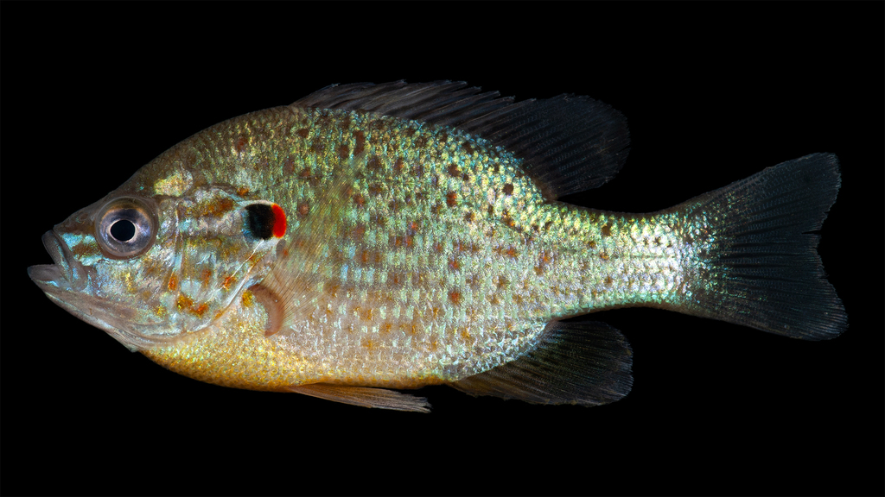

```{r setup, include=FALSE}
knitr::opts_chunk$set(echo = TRUE)
```

Yavno and Fox (2013) collected introduced pumpkinseed sunfish from four sites in Canada, two flowing water sites and two still water sites, and returned them to a holding facility. Progeny from mating between individuals within each population were then allocated to artificial channels and subjected to either still or flowing water for 80 days. Various morphological features for each fish were measured at the end of the experiment. Each morphological measurement was analyzed in a two-factor linear model, including the value of the centroid of nine points on the body as a measure of body size. Each morphological variable and the value of the centroid was log transformed before analysis.

[{width="800"}](https://www.flickr.com/photos/serc_biodiversity/50599396317/)

Pumpkinseed sunfish, *Lepomis gibbosus*. © Smithsonian Environmental Research Center, [CC BY 4.0](https://creativecommons.org/licenses/by/4.0)

The paper is [here](https://doi.org/10.1111/j.1365-2699.2012.02758.x) and the data are in the supplementary material S2

Yavno, S. & Fox, M. G. (2013). Morphological change and phenotypic plasticity in native and non-native pumpkinseed sunfish in response to sustained water velocities. *Journal of Evolutionary Biology*, 26, 2383-95.

### Preliminaries

First, load the required packages (car, interactions)

```{r include=FALSE, results='hide', error=TRUE}
source("../R/libraries.R")   #This is the common library
library(interactions)
library(effects)
```

Import yavno data file (yavno.csv)

```{r}
yavno <- read.csv("../data/yavno.csv")
head(yavno,10)
```

Check that the covariate is not affected by factors

```{r }
boxplot(log10(centroid)~pops*watervel, data=yavno)
cov.aov <- aov(log10(centroid)~pops*watervel, data=yavno)
summary(cov.aov)
```

Covariate affected by both factors and interaction using the anova result, but we're dealing with quite a sensitive test, give the residual df. Looking at the boxplots, however, the covariate ranges are broadly overlapping, and one group is a bit higher than the rest. It's not a clear-cut decision, but we'll do ancova anyway to match original paper.

## First bodydep

```{r }
boxplot(log10(bodydep)~pops*watervel, data=yavno)
scatterplot(log10(bodydep)~log10(centroid)|pops, data=yavno)
scatterplot(log10(bodydep)~log10(centroid)|watervel, data=yavno)
```

all looks OK

### Fit model using lm to get Type III SS

```{r }
bodydep.lm1 <- lm(log10(bodydep)~pops*watervel*log10(centroid), contrasts=list(pops=contr.sum,watervel=contr.sum), data=yavno)
plot(bodydep.lm1)
Anova(bodydep.lm1, type='III')
```

Combine covariate by factor terms into a single term

```{r }
bodydep.lm2 <- lm(log10(bodydep)~pops*watervel+log10(centroid), contrasts=list(pops=contr.sum,watervel=contr.sum), data=yavno)
anova(bodydep.lm1, bodydep.lm2)

Anova(bodydep.lm2, type='III')
```

### Plot of slopes

We'll create log10(centroid) as a new variable, rather than transforming it repeatedly in models.

```{r }
yavno$lcentroid <- log10(yavno$centroid)
bodydep.lm3 <- lm(log10(bodydep)~pops*watervel*lcentroid, data=yavno)
interact_plot(bodydep.lm3, pred=lcentroid, modx=pops, plot.points=TRUE, data=yavno)
interact_plot(bodydep.lm3, pred=lcentroid, modx=watervel, plot.points=TRUE, data=yavno)
```

Unequal slopes apparent for water velocity groups, but the sample size is large and the difference in slopes isn't great, so fit homogeneous slopes ancova model anyway

```{r }
bodydep.lm4 <- lm(log10(bodydep)~pops+watervel+pops*watervel+log10(centroid), contrasts=list(pops=contr.sum,watervel=contr.sum), data=yavno)
Anova(bodydep.lm4, type='III')
```

### Get adjusted means

```{r }
adjmeans <- effect("pops*watervel", bodydep.lm4, se=TRUE)
summary(adjmeans)
```
